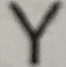

# Chracter-Recognition
First update

in this project i used opencv library to process img in order to procces images to recognizes chracters clearly.

firstly we have a main.cpp file includes all functions which is all procces happening here.

Other files are classifications.txt ,imagesArranged.txt. These txt files includes arrays from 20x30 white and black images writed for each pixsel  
clasifications.txt includes ASCII numbers for imagesArranged.txt file it sycronized for each array contains one chracter image.
in this files I check pixsels of chracters on by one and making decisions.

in test file contain images to recognization;

